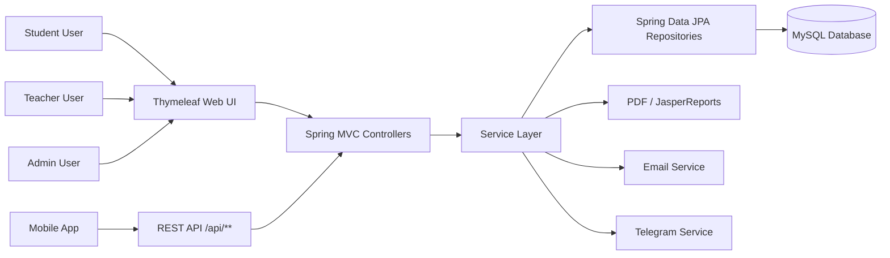

# Student Feedback System Project

## Slide 1. Title

Student Feedback System Using Spring Boot

Prepared for: Software Engineering / Web Development Students

Project Goal:
Build a secure web and API-based system that allows students to submit feedback, teachers to review results, and administrators to manage the whole process.

Presenter Notes:
This project is not only about coding. It teaches full-stack system design, database modeling, authentication, business rules, reporting, and deployment.

---

## Slide 2. Problem Statement

Many schools and universities still collect feedback manually.

Problems with manual feedback:
- Slow data collection
- Hard to summarize results
- Risk of missing or duplicated responses
- Difficult to protect anonymity and access control
- No real-time reporting for teachers and administrators

Our solution:
A Spring Boot Student Feedback System with web pages, REST APIs, secure login, role-based access, reporting, and mobile integration support.

---

## Slide 3. Project Objectives

Main objectives:
- Allow students to submit feedback for their enrolled class sections
- Allow teachers to view feedback statistics for their sections
- Allow teachers to complete self-assessment
- Allow administrators to manage semesters, courses, sections, join codes, and question sets
- Provide secure API access for mobile applications
- Generate reports for decision-making

Learning objectives for students:
- Understand layered architecture in Spring Boot
- Design relational database tables correctly
- Implement authentication and authorization
- Build both web UI and REST APIs in one project
- Test, deploy, and document a real information system

---

## Slide 4. Target Users

The system has 3 main roles:

1. Admin
- Manage cohorts, courses, semesters, teachers, sections, and evaluation windows
- Configure feedback questions
- Generate reports

2. Teacher
- View teaching sections
- See feedback statistics and comments
- Complete self-assessment
- Update profile

3. Student
- Log in securely
- View enrolled sections
- Join a section using a code or QR flow
- Submit feedback once during the allowed evaluation window
- Update profile and password

---

## Slide 5. Existing Project Features

This repository already demonstrates a strong real-world scope:
- Spring Boot web application with Thymeleaf pages
- MySQL database with Spring Data JPA
- Spring Security for login and role-based access
- JWT authentication for mobile API endpoints
- Student feedback submission workflow
- Teacher self-assessment workflow
- Section enrollment using join codes
- Email-based password reset
- Telegram integration support
- JasperReports and PDF reporting
- Docker and HTTPS deployment support

This makes the project a good capstone example because it covers business logic, security, UI, API, and deployment.

---

## Slide 6. Technology Stack

Backend:
- Java 21
- Spring Boot
- Spring Web
- Spring Data JPA
- Spring Security
- Thymeleaf

Database:
- MySQL

Security:
- Session-based login for web pages
- JWT for mobile APIs
- BCrypt password encoding

Other tools:
- Maven
- Docker Compose
- Nginx HTTPS reverse proxy
- JasperReports
- Apache POI

---

## Slide 7. High-Level Architecture

Architecture idea:
- Presentation layer: web pages and APIs
- Business layer: services and validation rules
- Data access layer: repositories
- Database layer: MySQL entities and relations

---

## Slide 8. Project Structure

Important package areas in the project:
- `api` for REST controllers such as login, student, teacher, and admin APIs
- `web` for web controllers and Thymeleaf pages
- `domain.entity` for database entities
- `domain.repo` for Spring Data JPA repositories
- `service` for business logic
- `config` for security and application configuration
- `resources/templates` for HTML pages
- `resources/application.properties` for database and app settings

Teaching point:
Students should separate responsibilities clearly. Controllers should not contain all business logic. Services should handle rules. Repositories should handle data access.

---

## Slide 9. Core Database Entities

Important entities in this project:
- `UserAccount`
- `Course`
- `Semester`
- `TeachingSchedule`
- `ClassSection`
- `Enrollment`
- `Question`
- `EvaluationWindow`
- `Submission`
- `Answer`
- `ClassJoinCode`
- `StudentRegistry`

Suggested explanation:
- One teacher can teach many sections
- One student can enroll in many sections
- One submission belongs to one student and one evaluation type
- One submission contains many answers
- One evaluation window controls when feedback is open or closed

---

## Slide 10. Main System Workflows

Workflow 1: Student feedback
1. Student logs in
2. Student sees enrolled sections
3. System checks whether feedback window is open
4. Student opens feedback questions
5. Student submits answers
6. System stores submission and answers
7. Student cannot submit again for the same section

Workflow 2: Teacher review
1. Teacher logs in
2. Teacher views teaching sections
3. Teacher opens section statistics
4. System calculates response rate, averages, and comments

Workflow 3: Admin management
1. Admin creates semester and courses
2. Admin configures questions and windows
3. Admin manages sections and join codes
4. Admin monitors results and reports

---

## Slide 11. Security Design

This project uses two security styles:

1. Web security
- Form login for browser users
- Session-based authentication
- Role-based redirects for admin, teacher, and student

2. API security
- JWT token issued after login
- Stateless requests for mobile app access
- Role protection on `/api/student/**`, `/api/teacher/**`, and `/api/admin/**`

Why this matters:
- Students learn practical security design
- Different clients can use different authentication models
- Sensitive data is protected by roles and access checks

---

## Slide 12. Sample API Use Cases

Examples from this project:
- `POST /api/auth/login`
- `GET /api/student/profile`
- `GET /api/student/sections`
- `GET /api/student/feedback/{sectionId}/questions`
- `POST /api/student/feedback/{sectionId}`
- `POST /api/student/join/{code}`
- `GET /api/teacher/profile`
- `GET /api/teacher/sections`
- `GET /api/teacher/sections/{sectionId}/stats`
- `GET /api/teacher/self-assessment/status`

Teaching point:
Students should learn how to design APIs that are:
- Clear
- Secure
- Consistent in response format
- Easy to consume from mobile applications

---

## Slide 13. UI Modules

The project includes multiple UI modules:
- Authentication pages: login, register, forgot password, reset password
- Admin pages: cohorts, courses, sections, windows, reports
- Student pages: profile, schedule, feedback, join section
- Teacher pages: profile, reports, self-assessment

Why this is good for student projects:
- Students can practice navigation and dashboard design
- They can connect forms to backend logic
- They can learn server-side rendering with Thymeleaf

---

## Slide 14. Recommended Development Phases

Phase 1. Requirement analysis
- Define actors, business rules, and use cases

Phase 2. Database design
- Draw ERD for users, courses, sections, questions, submissions, and answers

Phase 3. Backend foundation
- Create Spring Boot project
- Configure MySQL
- Create entities, repositories, and services

Phase 4. Authentication and authorization
- Implement login and role protection

Phase 5. Core features
- Student feedback
- Teacher statistics
- Admin management

Phase 6. UI and API integration
- Thymeleaf pages
- REST API for mobile support

Phase 7. Testing and deployment
- Unit testing
- Integration testing
- Docker deployment

---

## Slide 15. Suggested Team Roles

For a team project, students can split work like this:

1. Backend developer
- Entities, repositories, services, APIs

2. Frontend developer
- Thymeleaf pages, forms, layout, UX

3. Database designer
- ERD, relationships, constraints, query optimization

4. Security and deployment engineer
- Authentication, authorization, Docker, HTTPS

5. Tester and documentation lead
- Test cases, API documentation, user manual, presentation

This helps students practice collaboration similar to real software teams.

---

## Slide 16. Important Business Rules

Examples of business rules in this system:
- Only authenticated users can access protected functions
- Students can only submit feedback for sections where they are enrolled
- Students can submit only once per evaluation window
- Teachers can only view statistics for their own sections
- Admin controls when evaluation windows open and close
- Join codes can expire and can be limited by cohort, group, and shift

Teaching point:
Strong projects are built on business rules, not only on screens.

---

## Slide 17. Testing Strategy

Students should test at three levels:

1. Unit testing
- Service methods
- Validation logic

2. Integration testing
- Repository queries
- Controller endpoints
- Security rules

3. User acceptance testing
- Admin flow
- Teacher flow
- Student flow

Example test scenarios:
- Student cannot submit feedback twice
- Invalid join code is rejected
- Teacher cannot see another teacher's section stats
- Closed evaluation window blocks feedback submission

---

## Slide 18. Deployment Plan

This project already supports deployment ideas such as:
- Running the Spring Boot app with Maven
- Using MySQL as the database
- Containerizing services with Docker Compose
- Using Nginx as HTTPS reverse proxy

Deployment flow:
1. Configure database connection
2. Set environment variables
3. Build the project with Maven
4. Run containers with Docker Compose
5. Access the app through HTTPS

Teaching point:
Students should present not only code, but also how the system runs in production.

---

## Slide 19. Challenges and Solutions

Possible project challenges:
- Managing many user roles
- Preventing duplicate feedback submissions
- Designing correct database relationships
- Protecting sensitive data
- Keeping web and API behavior consistent
- Handling reporting and summary statistics

Possible solutions:
- Use role-based security with Spring Security
- Centralize logic in service classes
- Use JPA relationships carefully
- Validate all inputs on server side
- Keep a consistent API response format

---

## Slide 20. Future Improvements

Possible next steps for students:
- Add charts and analytics dashboard
- Add anonymous feedback mode with stronger privacy design
- Add CSV and Excel export
- Add notification system
- Add Flutter or Android mobile client
- Add audit logs and admin activity tracking
- Improve AI-based feedback summarization

This shows how a student project can evolve into a real campus product.

---

## Slide 21. Demo Scenario

Suggested live demo flow:
1. Login as admin and show semester, question, and window setup
2. Login as student and show enrolled sections
3. Submit feedback for one section
4. Login as teacher and show response statistics
5. Show API example with JWT login and a secured endpoint
6. Show Docker or deployment overview

This gives the audience a complete picture of the system.

---

## Slide 22. Conclusion

Key message:
The Student Feedback System is a complete academic project that demonstrates:
- Spring Boot backend development
- Database design with JPA
- Web development with Thymeleaf
- API development with JWT security
- Real-world business rules
- Reporting and deployment skills

Final takeaway:
This is a strong project topic because it connects software engineering theory with a practical campus problem.

---

## Slide 23. Short Presentation Script

You can say this at the beginning:

"Today I will present our Student Feedback System project built with Spring Boot. The goal of this system is to help educational institutions collect student feedback in a secure, structured, and efficient way. The system supports students, teachers, and administrators, and it includes both web pages and REST APIs. In this presentation, I will explain the problem, system architecture, core modules, database design, security, workflow, and deployment approach."

You can say this at the end:

"In conclusion, this project is more than a simple CRUD application. It demonstrates authentication, authorization, business logic, database relationships, reporting, and deployment. It is a suitable project for students who want to practice full-stack development using Spring Boot in a real-world academic scenario."

---

## Slide 24. Q and A

Questions?

Thank you.